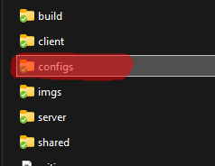

# 🚀 Transitioning the configs

In the latest update, we have moved and split the config to make it more sustainable to extend and modify. \
To avoid losing your valuable modifications, follow this brief guide on transitioning to the new version!

## What changed

With the latest update we created a new folder (`configs`)

<figure><figcaption>
New configs folder
</figcaption></figure>

In this folder you can find:

<figure><figcaption></figcaption></figure>

**expansions**: used for managing configs of expansions (eg. pizza)\
**config\_functions.lua**: classic config for functions\
**general.lua**: here you can find things that doesnt have a specific category/section (debug, translations, recovery, ecc..)\
**interactions.lua**: previous Config.Interactions\
**items.lua**: previous Config.Items\
**kitchens.lua**: previous Config.Kitchens

## How to transition

* copy your config\_functions.lua in config\_functions.lua
* copy your config.lua in general.lua

Now from general.lua:

* remove Config.Kitchens and move it to kitchens.lua
* remove Config.Interactions and move it to interactions.lua
* replace Config.Expansions with an empty table (`{}`)
* remove Config.Items and move it to items.lua

Your final general.lua should be something like this:

<figure><figcaption></figcaption></figure>

## <mark style="color:green;">**We have finished!**</mark>
